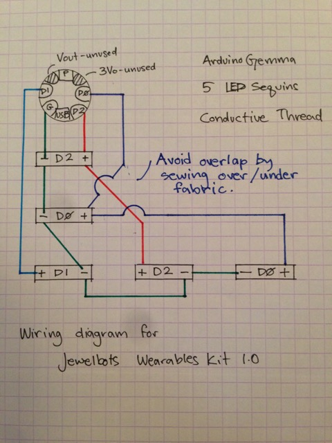

This is my collection of Arduino Gemma programs. They make things light up.

## LED sequins

The [Wearables] directory contains programs written for the
[Jewelbots](http://jewelbots.com/)
[Wearables Kit 1.0](http://jewelbots.com/intro-to-wearables-kit.html).

This kit combined an
[Arduino Gemma](https://www.arduino.cc/en/Main/ArduinoGemma) with five
[LED sequins](https://www.adafruit.com/product/1756) (our LEDs were green).

### Wiring

Two LEDs are wired to `D0`. Two are wired to `D2`. The final LED is wired to
`D1`. The Gemma has a `D1` light in the center of the board, meaning we also
have two `D1` lights!

When laying out the Gemma and LEDs, you can get a nice pattern by creating a
chain. In the following illustration, I have annotated the Gemma and LEDs by
the data line connecting to the light. Remember that the Gemma has a `D1`
light at its center.

```
Gemma(D1) - LED(D2) - LED(D0) - LED(D1) - LED(D2) - LED(D0)
```

If you just try and lay out this design on a flat surface, you are going to
have a hard time avoiding overlapping wires. This might not matter when using
coated wires, but it makes a different when sewing with
[conductive thread](https://learn.adafruit.com/conductive-thread)!

Avoid letting those overlapping threads touch by separating the thread with
layers of fabric. Thick fabric like felt worked well; thinner fabrics might
not be as effective.



## NeoPixel

The [NeoPixel] directory contains a number of programs that use the
[Adafruit NeoPixel Library](https://github.com/adafruit/Adafruit_NeoPixel)
with the [Arduino Gemma](https://www.arduino.cc/en/Main/ArduinoGemma).

I used the NeoPixel ring with 16 LED pixels. The programs may work with other
NeoPixel devices - you will at least need to adjust the number of pixels when
initializing the NeoPixel object:

```cpp
Adafruit_NeoPixel strip = Adafruit_NeoPixel(16, PIN);
```

A lot of the programs rotate/spin. Those designs might not be quite as
interesting on a linear NeoPixel strip.

### Wiring

Follow the wiring from Adafruit's
[Gemma Hoop Earrings](https://learn.adafruit.com/gemma-hoop-earrings/circuit-diagram)
project.

`GND` on the Gemma is wired to `GND` on the NeoPixel ring. The Gemma `Vout` goes to
`Vcc`. `D0` is wired to the ring's `Data IN`.
